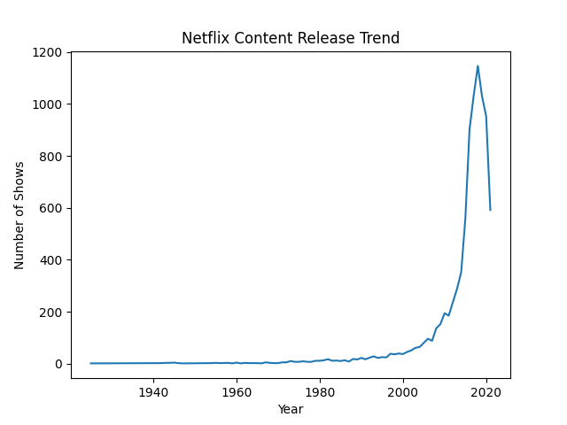
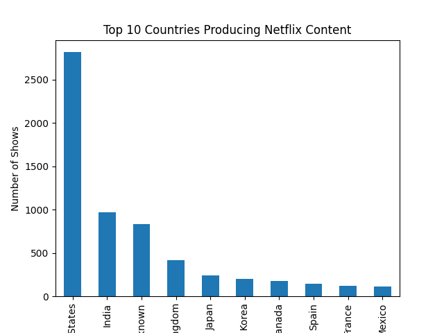
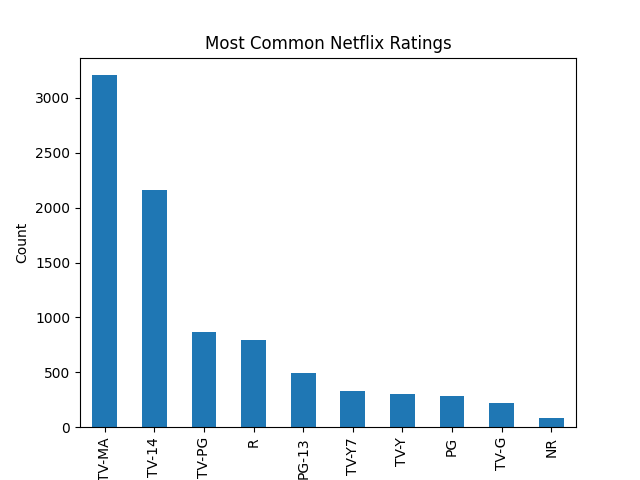
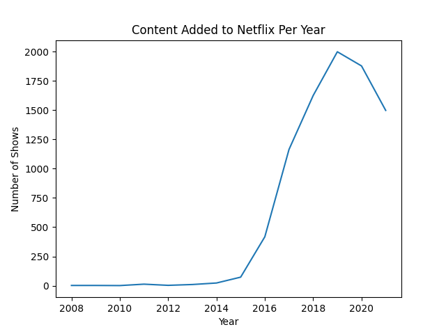

# Netflix Data Analysis

## Project Overview
This project analyzes the Netflix Movies and TV Shows dataset to discover trends in Netflix content.

The analysis was performed using Python with Pandas and Matplotlib.

## Tools Used
- Python
- Pandas
- Matplotlib

## Dataset
Netflix Movies and TV Shows Dataset containing information about Netflix content including:
- Title
- Type (Movie / TV Show)
- Country
- Release Year
- Rating
- Date Added

## Analysis Performed
1. Movies vs TV Shows distribution
2. Netflix content release trend
3. Top countries producing Netflix content
4. Most common ratings
5. Content added to Netflix per year

## Visualizations

### Movies vs TV Shows

### Content Release Trend

### Top Countries

### Ratings Distribution

### Content Added Per Year

## Author
Sanchita Saini